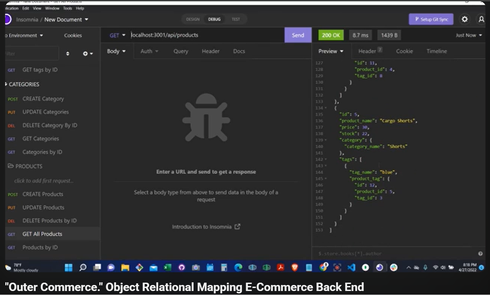

# Outer-Commerce

A modern **e-commerce backend API** built with **Node.js**, **Express**, **Sequelize**, and **MySQL**.

Outer-Commerce provides the core data layer for an online store, including product catalog management, category organization, and product tagging — all exposed through a clean REST API.

---



--------------------------------

## 🚀 Why Outer-Commerce?

Running an online store requires reliable, scalable backend services. This project is designed to provide a strong foundation for commerce platforms with:

- Structured product and inventory-ready data models
- Fast API development with Express
- Relational data management through MySQL + Sequelize
- Easy local setup for development and testing

Whether you’re building a storefront, admin dashboard, or internal commerce tooling, this backend gives you a practical starting point.

---

## ✨ Features

- **RESTful API** for:
  - Categories
  - Products
  - Tags
- Full **CRUD operations** (Create, Read, Update, Delete)
- **Sequelize model relationships** for connected commerce data
- **Seeded development database** for quick testing
- Environment-based configuration with `.env`

---

## 🧰 Tech Stack

- **JavaScript**
- **Node.js**
- **Express.js**
- **MySQL**
- **Sequelize ORM**
- **dotenv**

---

## 📦 Installation

1. **Clone the repository**

```bash
git clone https://github.com/MaxKarltun/Outer-Commerce.git
cd Outer-Commerce
```

2. **Install dependencies**

```bash
npm install
```

3. **Create your environment variables**

Create a `.env` file in the project root:

```env
DB_NAME=your_database_name
DB_USER=your_mysql_username
DB_PASSWORD=your_mysql_password
```

4. **Create and seed the database**

```bash
npm run seed
```

5. **Start the server**

```bash
npm start
```

---

## ▶️ Usage

Once the server is running, use a tool like **Insomnia** or **Postman** to test endpoints.

Typical routes include:

- `GET /api/categories`
- `GET /api/products`
- `GET /api/tags`
- `POST /api/products`
- `PUT /api/products/:id`
- `DELETE /api/products/:id`

---

## 🧪 Development Notes

This project was built as an e-commerce backend foundation and can be expanded with:

- Authentication and authorization
- Order and customer models
- Inventory tracking
- Payment integration
- API documentation (Swagger/OpenAPI)

A Swagger-focused branch is in progress (`swagger` branch).

---

## 🎥 Demo

YouTube walkthrough:

https://www.youtube.com/watch?v=BZ4SIYFjW-I&t=458s

---

## 📬 Contact

**Max Karltun Moreno**  
Karltunmoreno@gmail.com
